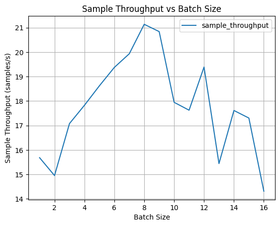
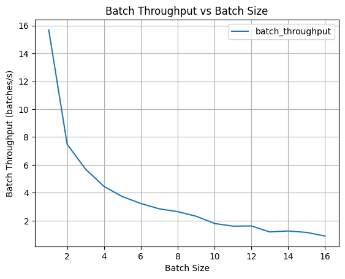
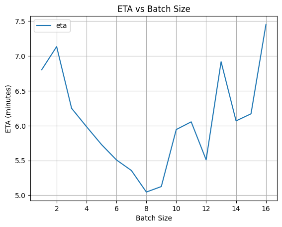

# Efficient URSSM replication

This repository contains a replicated version of [Unsupervised Learning of Robust Spectral Shape Matching (SIGGRAPH/TOG 2023)](https://dongliangcao.github.io/urssm/) with highly efficient implementation. **The training time of 1 epoch is reduced from ~75 min to ~6 min $^*$ on a single RTX 3090 GPU.**:

- Rewrote dataset & dataloader for ~20x faster loading
  > For the FAUST dataset, data loading throughput is boosted from 2.16 read/s (23 min in total) to 111.98 read/s (58 s in total)
- Batched computation is supported by padding all data to unified dimensions, following common practice in NLP (handled by customized [dataloader](src/dataloader/shape_cor_batch.py))
  > Mathematic equivalence are guaranteed by both theoretical analysis and numerical tests. Each module's output is masked as needed.
- All modules are fully vectorized. Following is the throughput comparison of some modules:

  > | Modules | Original (batch/s) $^*$ | Vectorized (batch/s) $^*$ |
  > | --- | --- | --- |
  > | [WKS_vectorized](src/module/point_descriptor.py) | 105.27 | 5000.36 |
  > | [DiffusionNet_vectorized](src/module/diffusionnet_vectorized.py) | 30.73 | 50.96 |
  > | [RegularizedFMaps_vectorized](src/module/fmap.py) | 2.20 | 73.18 |
  > | [GeodesicDist_vectorized](src/metric/geodist.py) | 4.30 | 4841.63 |

$^*$ Batch size is set as 8 with 1 RTX 3090 GPU.





_P.S. ETA hear obmits the time used for test dataset evaluations._

## Setup env

```bash
conda create -n fmap python=3.10
conda activate fmap
pip3 install torch torchvision torchaudio --index-url https://download.pytorch.org/whl/cu118
pip install -r requirements.txt
```

_P.S. If you encouter any issue, you can check the exact package versions listed in [environment.yml](environment.yml). You may also create the env from it:_

```bash
conda env create -f environment.yml
```

## Dataset & preprocessing

To train and test datasets used in this paper, please download the datasets from the this [link](https://drive.google.com/file/d/1zbBs3NjUIBBmVebw38MC1nhu_Tpgn1gr/view?usp=share_link) and put all datasets under `data/`

```bash
├── data
    ├── FAUST_r
    ├── FAUST_a
    ├── SCAPE_r
    ├── SCAPE_a
    ├── SHREC19_r
    ├── TOPKIDS
    ├── SMAL_r
    ├── DT4D_r
    ├── SHREC20
    ├── SHREC16
    ├── SHREC16_test
```

We thank the original dataset providers for their contributions to the shape analysis community, and that all credits should go to the original authors.

### Data preparation
For data preprocessing, we provide *[preprocess.py](preprocess.py)* to compute all things we need. Here is an example for FAUST_r:

```bash
python preprocess.py --data_root ../data/FAUST_r/ --k_eig 200
```

_P.S. To improve data loading efficiency, the caching mechanism in the original implementation is removed. Folder structure is changed accordingly. Therefore, if you're shifting from the original implementation, you will need to redo the preprocessing with the command above._

## Training

Single GPU training:

```bash
python train.py --config config/vec.yaml
```

[Distributed Data Parallel (DDP)](https://docs.pytorch.org/tutorials/intermediate/ddp_tutorial.html) training with Multiple GPUs:

```bash
python train_ddp.py --config config/vec-ddp.yaml
```

View train/test loss during or after training:

```bash
tensorboard --logdir experiment/
```

## Remark

`notebook/prototype` folder contains temporal prototype code during development. It might not be able to run afterwards. Don't use them as a reference.